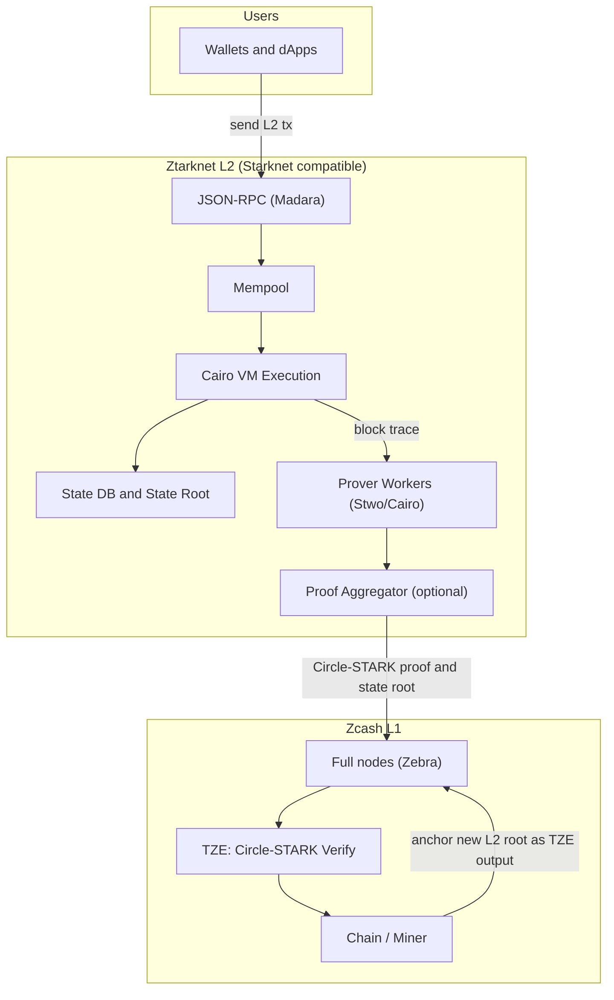
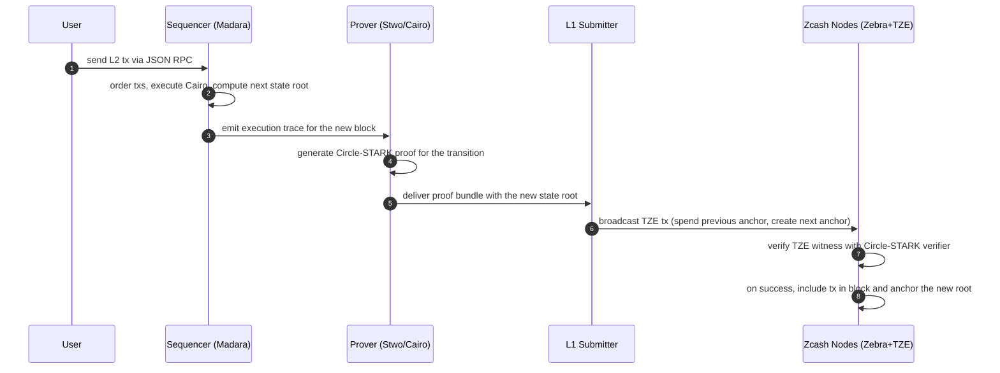

  
  <h1>Ztarknet 🛡️🐺 </h1>
  
Starknet-based L2 for Zcash

  

    <a href="https://github.com/AbdelStark/ztarknet">Repository</a> ·
    <a href="https://github.com/AbdelStark/zebra">Circle STARK-enabled Zebra fork</a> ·
    <a href="https://github.com/zcash/zips/pull/1107">Circle STARK draft ZIP</a> ·
    <a href="https://forum.zcashcommunity.com/t/stark-verification-as-a-transparent-zcash-extension-tze-i-e-enabler-for-a-starknet-style-l2-on-zcash/52486/15">Forum discussion</a>
  

> **Status:** concept + references for a proof-of-concept (PoC). This repo documents the idea, constraints, and minimum components to explore a Starknet-like rollup that settles to **Zcash L1** via a **Transparent Zcash Extension (TZE)** that verifies **Circle STARK** proofs.

## What is Ztarknet 🛡️🐺?

**Ztarknet 🛡️🐺** proposes a Starknet-style L2 that executes **Cairo** programs, proves the resulting state transitions with [**Circle STARKs**](https://eprint.iacr.org/2024/278) ([Stwo](https://github.com/starkware-libs/stwo-cairo)), and **settles** those transitions on **Zcash L1** by having full nodes verify the proof natively via a TZE verifier. It reuses an existing Starknet client (e.g., **Madara**) for sequencing/execution and a **Stwo/Cairo** prover for proofs. The L1 verification surface is a **single TZE type** defined by a draft ZIP.

**Why Zcash?** Zcash already offers strong base-layer privacy. Ztarknet explores **programmability and scale** via an L2—with validity proofs checked natively on Zcash using the TZE framework ([ZIP-222](https://zips.z.cash/zip-0222)) and the associated digest changes (ZIP-245/244).

## Rationale

- **Separation of concerns:** keep Zcash L1 minimal, push general execution to an L2 VM (Cairo), and anchor L2 with succinct validity proofs.
- **Clean L1 integration:** use a **TZE** rather than Script changes; TZEs were designed to add new transparent validity conditions in a well-bounded way.
- **Rust-native path:** Madara (Rust) and Stwo/Cairo (Rust verifier + CLI) keep the prototype within Zebra’s Rust ecosystem.

## Prerequisites and scope

1. **TZE verifier on Zcash** — a draft ZIP introduces a **Circle‑STARK verifier as a TZE** (single `type`, one mode). Zebra fork with draft plumbing is here.

   - [Draft ZIP PR](https://github.com/zcash/zips/pull/1107): **“Circle STARK Verification as a TZE”**.
   - [Forum discussion thread summarizing intent and constraints.](https://forum.zcashcommunity.com/t/stark-verification-as-a-transparent-zcash-extension-tze-i-e-enabler-for-a-starknet-style-l2-on-zcash/52486/15)
   - Prototype work will target **Zebra** first. Fork: [`AbdelStark/zebra`](https://github.com/AbdelStark/zebra)

2. **Sequencer/execution** — reuse [**Madara**](https://github.com/madara-alliance/madara) (Starknet client, Rust) for L2 networking, JSON‑RPC, execution, and local state.

3. **Prover** — use [**Stwo/Cairo**](https://github.com/starkware-libs/stwo-cairo) to produce Circle‑STARK proofs of Cairo programs (`cairo-prove` JSON for the MVP).

4. **Data Availability (DA)** — PoC will **start minimal** (publish L2 state roots only). DA must be evaluated separately. Main focus for now is the proof verification.

---

## High‑level architecture

- **Sequencer:** batches L2 txs, executes Cairo contracts, computes next **state root**.
- **Prover:** consumes the execution trace, generates a **Circle‑STARK** proof.
- **Submitter:** builds a Zcash **TZE transaction** that _spends_ the previous L2 anchor and _creates_ the next anchor, carrying the new root and proof.
- **Zcash nodes** run the **TZE verifier** (per ZIP) as part of tx validation; if valid, the anchor updates on L1.

Starknet’s own docs describe this pattern generically (accounts, block state commitments, proof generation/verification on L1, and DA). Ztarknet mirrors that flow but anchors to **Zcash** via TZE instead of a Solidity verifier on Ethereum.

## Settlement pattern on Zcash L1 (anchor UTXO)

> TBD: mostly raw thoughts at the moment, and far from fully fleshed design

**Anchor UTXO chain:** represent L2 progression as a chain of **TZE outputs**:

- **Genesis:** create `Anchor_0` TZE output with precondition committing to `root_0`.
- **Step k→k+1:** submit tx that _spends_ `Anchor_k` and _creates_ `Anchor_{k+1}`.
  The TZE witness carries a proof that _executing the Cairo L2 program from `root_k` with block `k+1` txs yields `root_{k+1}`_. The precondition of `Anchor_{k+1}` commits to `root_{k+1}`.
  Zcash nodes verify the proof using the TZE verifier; if valid, `Anchor_{k+1}` becomes the new on‑chain commitment.

This uses **ZIP‑222**’s model (precondition/witness per extension `type`) and integrates with **ZIP‑245/244** digests so TZE data is committed correctly in txid/signature trees.

## End‑to‑end flow (happy path)

- **Sequencer/exec** can be **Madara** (Rust Starknet client), which has Starknet‑compatible RPC and computes state commitments.
- **Prover** uses **Stwo/Cairo**; for the PoC we can consume JSON (`cairo-prove`) directly.
- **Verifier on L1** is the TZE described in the draft ZIP: a single `type`/`mode` whose `tze_verify` invokes the Stwo verifier on the witness bytes and checks the claimed public inputs/commitments.

## Components to stand up a PoC

- **L2 node:** **Madara**—run a local testnet sequencer (Starknet‑compatible RPC), produce blocks and state roots.
- **Prover:** **Stwo/Cairo**—generate proofs for small Cairo programs with `cairo-prove`; start with simple programs (hashing/merkle updates) and progress to a minimal L2 state transition.
- **Submitter tool:** small Rust bin to bundle `(precondition, witness)` and build a TZE tx.
- **Zcash node:** **Zebra fork** with the **TZE verifier** enabled, gated on a dev/test network activation.

## Resources

- [Ztarknet repo (this)](https://github.com/AbdelStark/ztarknet)
- [Zebra fork with draft TZE plumbing — target host for the verifier.](https://github.com/AbdelStark/zebra)
- [Draft ZIP PR — Circle‑STARK Verification as a TZE.](https://github.com/zcash/zips/pull/1107)
- [Forum thread — discussion: “STARK verification as a TZE; enabler for a Starknet‑style L2 on Zcash”.](https://forum.zcashcommunity.com/t/stark-verification-as-a-transparent-zcash-extension-tze-i-e-enabler-for-a-starknet-style-l2-on-zcash/52486/15)
- [Madara — Starknet client (Rust), state commitment & RPC.](https://github.com/madara-alliance/madara)
- [Stwo/Cairo — Cairo proof generation and Rust verifier.](https://github.com/starkware-libs/stwo-cairo)
- [Starknet protocol intro — accounts, blocks, proofs, DA](https://docs.starknet.io/learn/protocol/intro)

## License

This project is licensed under [MIT](LICENSE).
